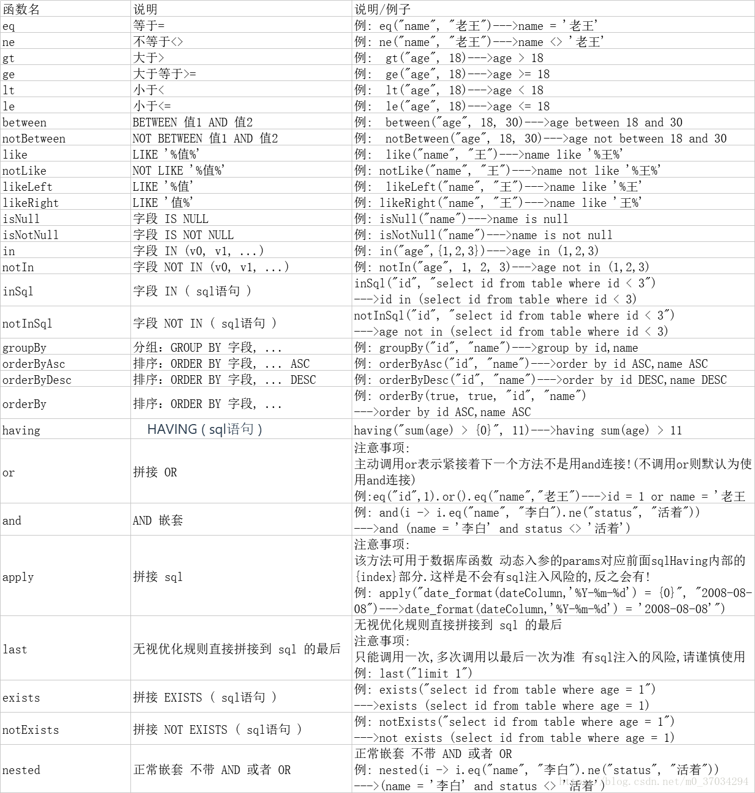
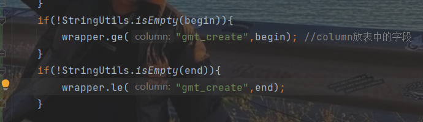

### 一.swagger
- 1.生成在线接口文档
- 2.方便接口测试
- swagger固定访问地址：
  - swagger-ui.html

### 二、QueryWrapper的方法

- wrapper 中的column应该放表中字段，而不是放实体类变量名
- 
- Page<EduTeacher> pageTeacher = new Page<>(current,limit); 
  - 这是分页查询，每页limit条数据，查询到第current页
- teacherService.page(page,wrapper)
  - 条件分页查询，wrapper是构造的条件，若无条件，只是单纯的分页查询，则:
  - teacherService.page(page,null);或者teacherService.page(page)

